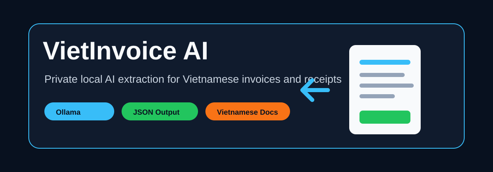
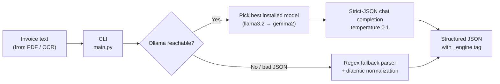

# VietInvoice AI



> **Privacy-first extraction of structured JSON from Vietnamese invoices — powered by a local LLM via Ollama, with a zero-dependency regex fallback so it always works.**


-22C55E?style=for-the-badge)


Vietnamese businesses handle invoices, receipts, and payment documents full of sensitive financial data. **VietInvoice AI** turns messy Vietnamese invoice text into clean, structured JSON — entirely on your own machine. Nothing is ever sent to a cloud API.

```bash
python3 main.py data/sample_invoice.txt
```

```json
{
  "vendor": "CONG TY TNHH CONG NGHE SAO VIET",
  "tax_code": "0312345678",
  "invoice_number": "HD-2026-0420",
  "date": "20/04/2026",
  "buyer": "Cong ty Co phan Minh An",
  "description": "Phi trien khai he thong AI phan tich du lieu noi bo",
  "total_amount_vnd": 24500000,
  "confidence": 1.0,
  "_engine": "ollama:llama3.2"
}
```

## Features

- **Local LLM extraction via Ollama** — talks to the Ollama HTTP API (`/api/chat`) with a strict-JSON system prompt and low temperature for deterministic field extraction. Your invoice text never leaves your machine.
- **Automatic model selection** — queries your installed models (`/api/tags`) and picks the best available from a preference list (`llama3.2`, `llama3.1`, `qwen2.5`, `qwen2`, `mistral`, `gemma2`), falling back to whatever you have pulled.
- **Graceful degradation** — if Ollama is down or the model returns invalid JSON, the CLI automatically falls back to a rule-based parser and tells you on stderr. The pipeline never just dies.
- **Vietnamese-aware regex fallback** — normalizes the full set of Vietnamese diacritics (`đ → d`, `ế → e`, …) before matching labeled fields like `Ma so thue`, `So hoa don`, `Ngay`, `Khach hang`, `Tong cong`.
- **VND amount parsing** — converts Vietnamese-formatted totals like `24.500.000 VND` into a plain integer (`24500000`) ready for accounting systems.
- **Confidence scoring** — the fallback parser reports how many of the 7 target fields it actually found, so downstream code can decide whether to trust the result.
- **Engine provenance** — every result carries an `_engine` field (`ollama:<model>` or `regex-fallback`) so you always know how the data was produced.
- **Zero third-party dependencies** — pure Python standard library (`urllib`, `re`, `json`, `argparse`, `pathlib`). No `pip install`, no virtualenv required.

## How It Works



The project deliberately starts from **extracted text** rather than raw PDFs or images: the AI extraction layer is the hard, interesting part, and it can be plugged behind any OCR or PDF-text pipeline later.

### Output Schema

| Field | Type | Example |
|---|---|---|
| `vendor` | string | `CONG TY TNHH CONG NGHE SAO VIET` |
| `tax_code` | string | `0312345678` |
| `invoice_number` | string | `HD-2026-0420` |
| `date` | string | `20/04/2026` |
| `buyer` | string | `Cong ty Co phan Minh An` |
| `description` | string | `Phi trien khai he thong AI...` |
| `total_amount_vnd` | integer | `24500000` |
| `confidence` | float | `1.0` |
| `_engine` | string | `ollama:llama3.2` or `regex-fallback` |

## Getting Started

### Prerequisites

- **Python 3.9+** — that's it for fallback mode (the project uses only the standard library).
- **[Ollama](https://ollama.com)** with at least one pulled model — only needed for local AI mode.

### Run without a local model (regex fallback)

Works anywhere Python runs, instantly:

```bash
git clone https://github.com/DucMinhNe/viet-invoice-ai.git
cd viet-invoice-ai
python3 main.py data/sample_invoice.txt --fallback-only
```

### Run with local AI (Ollama)

```bash
ollama serve
ollama pull llama3.2
python3 main.py data/sample_invoice.txt
```

If Ollama isn't running, the CLI prints a notice to stderr and transparently uses the fallback parser instead.

### Smoke test

A self-contained end-to-end check that runs the CLI against the bundled sample invoice and validates the required fields:

```bash
python3 scripts/smoke_test.py
# Smoke test passed.
```

### CLI Reference

```text
usage: main.py [-h] [--fallback-only] file

positional arguments:
  file             Path to invoice text extracted from PDF/OCR.

optional arguments:
  --fallback-only  Skip Ollama and use the local rule parser.
```

## Example: Fallback Mode

```bash
python3 main.py data/sample_invoice.txt --fallback-only
```

```json
{
  "vendor": "CONG TY TNHH CONG NGHE SAO VIET",
  "tax_code": "0312345678",
  "invoice_number": "hd-2026-0420",
  "date": "20/04/2026",
  "buyer": "cong ty co phan minh an",
  "description": "phi trien khai he thong ai phan tich du lieu noi bo",
  "total_amount_vnd": 24500000,
  "confidence": 1.0,
  "notes": "Extracted with regex fallback because local AI was unavailable.",
  "_engine": "regex-fallback"
}
```

## Project Structure

```text
viet-invoice-ai/
├── main.py                        # Entry point — delegates to the CLI
├── viet_invoice_ai/
│   ├── cli.py                     # Argument parsing + engine orchestration
│   ├── ollama_client.py           # Ollama HTTP client, model selection, JSON prompt
│   └── fallback_parser.py         # Diacritic normalization + labeled-field regex parser
├── scripts/
│   └── smoke_test.py              # End-to-end CLI smoke test
├── data/
│   └── sample_invoice.txt         # Sample Vietnamese service invoice
└── docs/
    ├── banner.svg                 # Project banner
    ├── usage.md                   # Usage guide (fallback vs. local AI mode)
    └── technical-notes.md         # Extraction strategy and target schema notes
```

## Tech Stack

| Layer | Choice | Why |
|---|---|---|
| Language | Python 3.9+ (stdlib only) | Zero-install portability — no dependencies to manage |
| Local AI | [Ollama](https://ollama.com) HTTP API | Private, on-device LLM inference; model-agnostic |
| LLM models | llama3.2 / llama3.1 / qwen2.5 / qwen2 / mistral / gemma2 | Auto-selected from whatever is installed |
| Fallback engine | `re` + Vietnamese diacritic translation table | Deterministic, offline, demo-friendly |
| Output | JSON (UTF-8, `ensure_ascii=False`) | Easy to pipe into accounting tools and scripts |

## Documentation

- [Usage Guide](./docs/usage.md) — fallback vs. local AI mode, recommended input labels
- [Technical Notes](./docs/technical-notes.md) — extraction strategy and target JSON schema

## Roadmap

- Real PDF text extraction.
- OCR for scanned receipt images.
- CSV / Excel export.
- Batch processing for folders of invoices.
- JSON schema validation for local AI responses.

## License

Released under the [MIT License](LICENSE).
