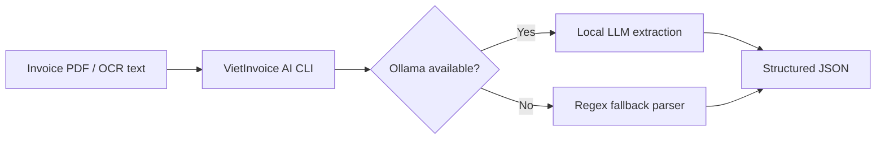

# VietInvoice AI


**VietInvoice AI** is a small local AI tool that extracts structured data from Vietnamese invoices and receipts. It is designed for privacy-first workflows where invoice text should be processed on the user's own machine instead of being sent to a cloud API.

The tool uses **Ollama** when a local model is available, and includes a rule-based fallback parser so the demo still works without a running model.

## What It Extracts

```json
{
  "vendor": "CONG TY TNHH CONG NGHE SAO VIET",
  "tax_code": "0312345678",
  "invoice_number": "HD-2026-0420",
  "date": "20/04/2026",
  "buyer": "Cong ty Co phan Minh An",
  "description": "Phi trien khai he thong AI phan tich du lieu noi bo",
  "total_amount_vnd": 24500000,
  "confidence": 1.0
}
```

## Why This Project Exists

Vietnamese businesses often handle invoices, receipts, and payment documents that contain sensitive financial information. A local AI extractor can help teams:

- reduce manual data entry
- prepare invoice data for accounting systems
- review tax codes and invoice numbers faster
- keep document text on the local machine
- build an internal document automation workflow

## Architecture



## Quick Start

Run without Ollama using the fallback parser:

```bash
python3 main.py data/sample_invoice.txt --fallback-only
```

Run a quick smoke test:

```bash
python3 scripts/smoke_test.py
```

Run with local AI:

```bash
ollama serve
ollama pull llama3.2
python3 main.py data/sample_invoice.txt
```

## Example Output

```bash
python3 main.py data/sample_invoice.txt --fallback-only
```

```json
{
  "vendor": "CONG TY TNHH CONG NGHE SAO VIET",
  "tax_code": "0312345678",
  "invoice_number": "hd-2026-0420",
  "date": "20/04/2026",
  "buyer": "cong ty co phan minh an",
  "description": "phi trien khai he thong ai phan tich du lieu noi bo",
  "total_amount_vnd": 24500000,
  "confidence": 1.0,
  "notes": "Extracted with regex fallback because local AI was unavailable.",
  "_engine": "regex-fallback"
}
```

## Project Structure

```text
viet-invoice-ai/
├── main.py
├── viet_invoice_ai/
│   ├── cli.py
│   ├── fallback_parser.py
│   └── ollama_client.py
├── data/
│   └── sample_invoice.txt
└── docs/
    └── banner.svg
```

## Notes

This project starts from extracted text, which means it can be connected to OCR or PDF text extraction later. The current focus is the AI extraction layer: turning messy Vietnamese invoice text into structured JSON.

More details:

- [Usage Guide](./docs/usage.md)
- [Technical Notes](./docs/technical-notes.md)

## Future Improvements

- Add real PDF text extraction.
- Add OCR for scanned receipt images.
- Export results to CSV or Excel.
- Add batch processing for folders of invoices.
- Add JSON schema validation for local AI responses.

## GitHub Description

```text
Private local AI tool for extracting structured JSON from Vietnamese invoices using Ollama.
```

## Roadmap
